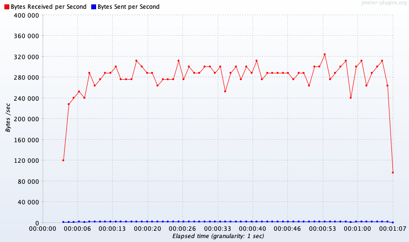
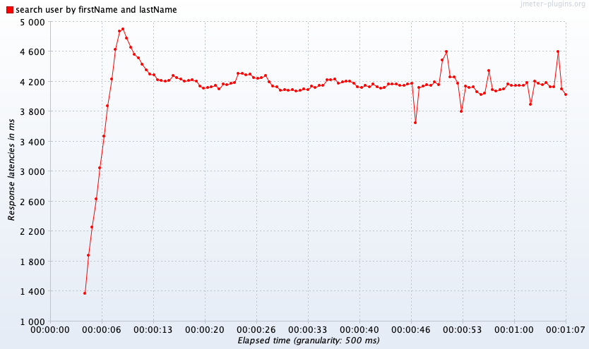
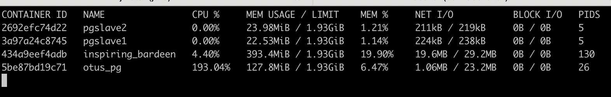
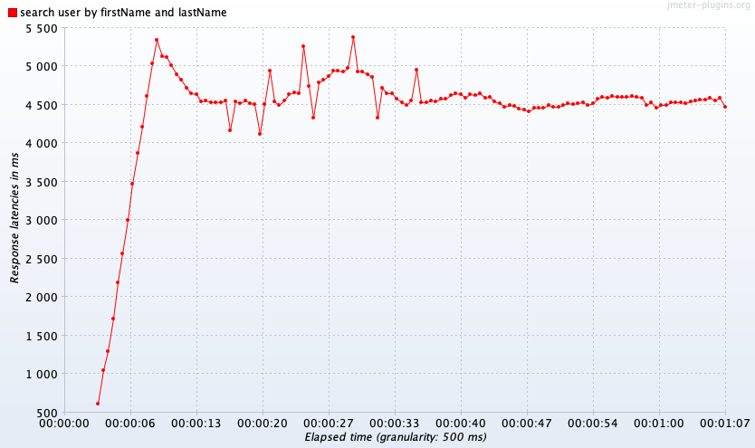
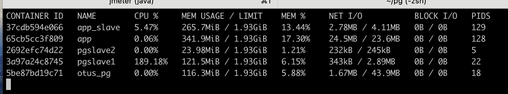
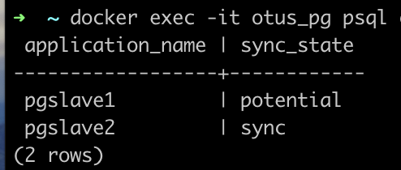
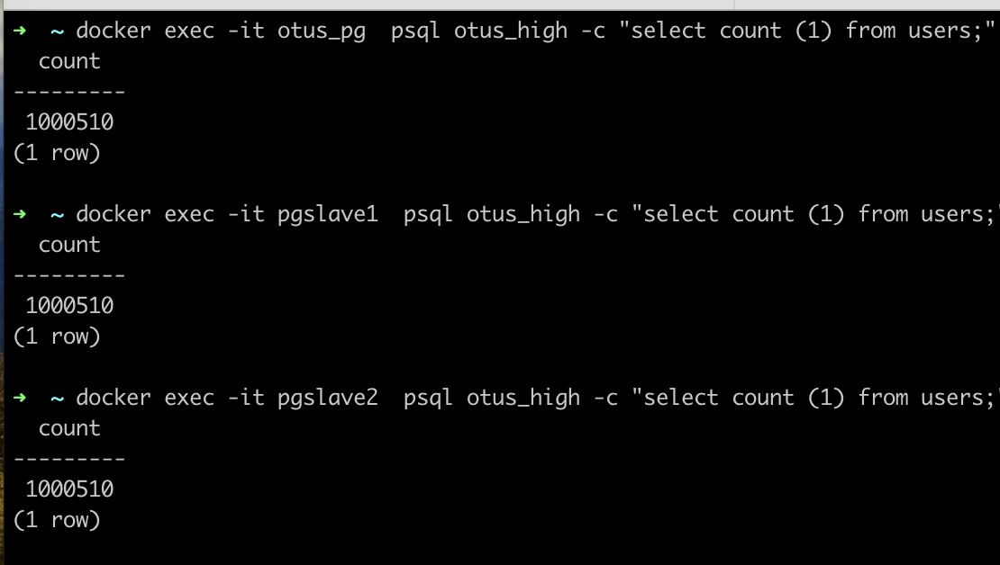
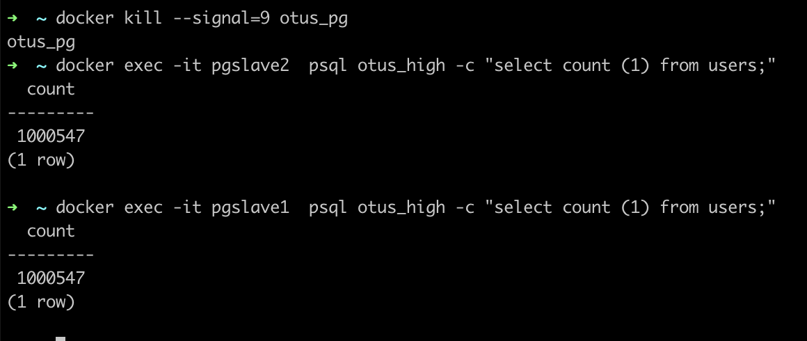
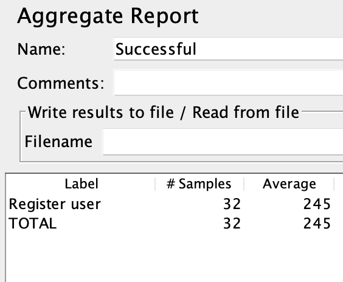

## Set up

docker network create otus

docker run --name otus_pg --network otus -p 5432:5432 -v ~/pg/master:/var/lib/postgresql/data -v ~/data:/data -e
POSTGRES_USER=root -e POSTGRES_PASSWORD=root -e POSTGRES_DB=otus_high -d postgres

docker run -d -p 8080:8080 --name app --network otus -e DB_TYPE=postgres ygmelnikov/otus_hl_arm:0.0.3

---

## Populate DB

docker exec -it otus_pg psql otus_high -c "COPY cities FROM '/data/cities.csv' DELIMITER ',' CSV HEADER;" \
docker exec -it otus_pg psql otus_high -c "COPY users FROM '/data/users.csv' DELIMITER ',' CSV HEADER;" \
docker exec -it otus_pg psql otus_high -c "ALTER SEQUENCE cities_id_seq restart with 200;" \
docker exec -it otus_pg psql otus_high -c "ALTER SEQUENCE users_id_seq restart with 1000001;"

---

## Setup replication

vim ~/pg/master/postgresql.conf \
ssl = off \
wal_level = replica

docker exec -it otus_pg psql otus_high \
create role replicator with login replication password 'pass';

vim ~/pg/slave2/pg_hba.conf \
host replication replicator 172.16.0.0/16 md5

docker exec -it otus_pg /bin/bash \
mkdir /pgslave \
pg_basebackup -h otus_pg -D /pgslave -U replicator -v -P --wal-method=stream

docker cp otus_pg:/pgslave/ ~/pg/slave1/ \
touch ~/pg/slave1/standby.signal

vim ~/pg/slave1/postgresql.conf \
primary_conninfo = 'host=otus_pg port=5432 user=replicator password=pass application_name=slave1'

docker run -dit -v ~/pg/slave1/:/var/lib/postgresql/data -e POSTGRES_PASSWORD=pass -p 5433:5432 --network=pgnet
--restart=unless-stopped --name=pgslave1 postgres

docker cp otus_pg:/pgslave/ ~/pg/slave2/ \
touch ~/pg/slave2/standby.signal

vim ~/pg/slave2/postgresql.conf \
primary_conninfo = 'host=otus_pg port=5432 user=replicator password=pass application_name=slave2'

docker run -dit -v ~/pg/slave2/:/var/lib/postgresql/data -e POSTGRES_PASSWORD=pass -p 5433:5432 --network=pgnet
--restart=unless-stopped --name=pgslave2 postgres

---

## Load master

jmeter -t ~/IdeaProjects/otus-highload/labs/lab03/lab03.jmx \
with read and master_DB

---

## Start app-2 to replica DB, test

docker run -d -p 8081:8080 --name app_slave --network otus -e DB_TYPE=postgres -e PG_URL=jdbc:postgresql://pgslave1:
5432/otus_high ygmelnikov/otus_hl_arm:0.0.3 \
jmeter -t ~/IdeaProjects/otus-highload/labs/lab03/lab03.jmx \
with read and replica-slave1_DB

---

## Load write to master, kill master

vim ~/pg/master/postgresql.conf \
synchronous_commit = on \
synchronous_standby_names = 'FIRST 1 (pgslave2, pgslave1)'

docker exec -it otus_pg psql otus_high -c "select pg_reload_conf();" \
docker exec -it pgslave2 psql otus_high -c "select application_name, sync_state from pg_stat_replication;"

jmeter -t ~/IdeaProjects/otus-highload/labs/lab03/lab03.jmx \
with write

docker kill --signal=9 otus_pg \

---

## Promote slave
docker exec -it pgslave2 psql otus_high -c "select * from pg_promote();"

vim ~/pg/slave2/postgresql.conf \
synchronous_commit = on
synchronous_standby_names = 'FIRST 1 (pgslave1)'

docker exec -it pgslave2 psql otus_high -c "select pg_reload_conf();"

vim ~/pg/slave1/postgresql.conf \
primary_conninfo = 'host=pgslave2 port=5432 user=replicator password=pass application_name=pgslave1'

docker exec -it pgslave1 psql otus_high -c "select pg_reload_conf();"

docker exec -it pgslave2 psql otus_high -c "select application_name, sync_state from pg_stat_replication;"

---